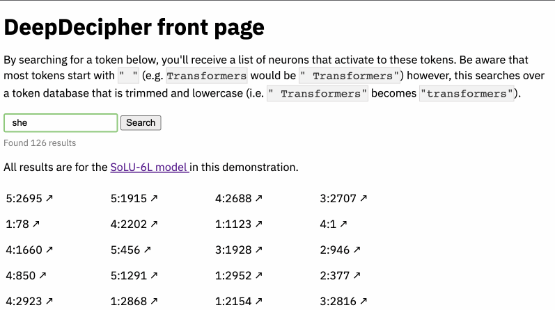
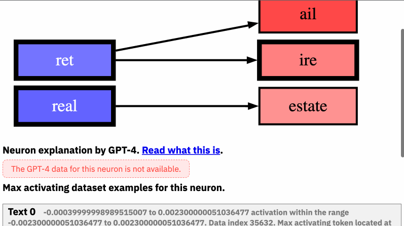
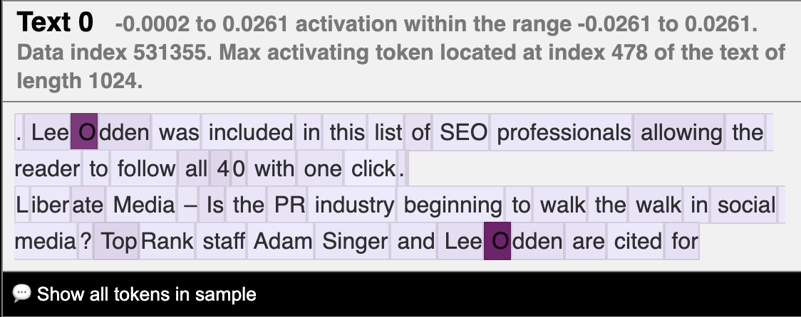

# DeepDecipher

🦠 This repository is the open source website for DeepDecipher, a continuation of the [neuroscope.io](https://neuroscope.io/) project [Nanda, 2022].

Contributers, see [below](#contributor-setup) for a setup guide. See [the data available](#data-available-per-neuron) through the official API (TBD).

**DeepDecipher** is a package that exposes methods to generate information from arbitrary [HookedTransformer classes](https://github.com/neelnanda-io/TransformerLens/blob/3cd943628b5c415585c8ef100f65989f6adc7f75/transformer_lens/HookedTransformer.py#L48), scrape existing databases of information about neurons within the field of mechanistic interpretability, search over neuron stores generated from [the Neuron2Graph package](https://github.com/apartresearch/neuron2graph), and set up a server with an API and a server with a UI that interfaces with the API.

As part of the publication of the paper, we also present a publicly available API developed using **DeepDecipher** (TBD).

See the search UI in action here:


See the neuron information UI pages in action here:


## Features

- [x] The NeuroNav Python package to dynamically load neuron information from any available existing APIs, such as [neuroscope.io](https://neuroscope.io) and the [OpenAI Neuron Explainer](https://openaipublic.blob.core.windows.net/neuron-explainer/neuron-viewer/index.html) [API](https://github.com/openai/automated-interpretability).
- [x] The NeuroNav Python package also provides functionality to compile data folders from any setup script and serve it as a data-efficient API on a server. This includes a simple setup to use raw JSON.
- [x] The NeuroNav API is an extensible and active API to [relevant variables for single-neuron analysis](#data-available-per-neuron)
- [ ] The API has access to relevant layer- and model-size information, such as layer neurons sorted by how interesting they are
- [x] The NeuroNav front-end is an application to navigate the neurons in the style of neuroscope [(Nanda, 2022)](neuroscope.io)
- [x] We implement a search that reveal interesting examples of behavior

## Data available per neuron

- NeuroScope's max activating dataset examples on 25 models
- Neuron2Graph's neuron activation model, along with the explanation power
- GPT-4's neuron activation explanation, along with the explanation power

Future data ideas:

- Which neurons have the most impact on this neuron's activation (based on weights)
- The neuron's embedding based on Neuron2Graph model
- Neuron interest variable: Variance / kurtosis of activation
- Which neurons is it connected to within the MLP layers
- Which neurons does this neuron impact the most (based on weights)
- Which tokens it passes to the residual stream (?)
- Neuron activation differences over training epochs (only available on Pythia models)
- Most correlating neurons
- Subnetwork analysis: Identification of groups of neurons that often activate together.
- Topological role: Information about the neuron's role in the overall network topology (e.g., hub, peripheral, connector, etc.) using weighted directional network summary statistics methods
- (?) Logit attribution: How much does this neuron affect the output

## Data available per layer

- Top interesting neurons
- Links to all neurons
- Meta data

## Data available per model

- Top interesting neurons by layer
- Links to all layers
- Meta data

## JSON response

```
> print(request.get("https://apartresearch.com/neuronav/api/GPT-2-XL/5/2332").json())

{
    "model" : "GPT-2 XL",
    "available" : ["Neuron Graph", "GPT-4 Explanation", "Max Activating Dataset Example"],
    "layer" : 5,
    "neuron" : 2332,
    "metadata" : {
        ...
    },
    "neuroscope" : {
        ...
    },
    "neuron2graph" : {
        "explanation-score" : 0.56,
        ...
    },
    "GPT-4" {
        "explanation-score" : 0.43,
        ...
    }
}
```

## Contributor setup

This guide will ensure you have the right environment and start a small instance of Neuronav that serves only Neuroscope data on the `solu-1l` model.
Tested in Windows Subsystem for Linux with Ubuntu 22.04.2 LTS.

1. Ensure you have a working Python installation (at least version 3.7, tested with version 3.10.7).
2. Ensure you have a working Rust toolchain (if you can use the `cargo` command it should be fine).
   See [here](https://www.rust-lang.org/tools/install) to get one.
   Any version from the last few years should work.
   The newest one definitely will.
3. Clone the repo and move to the root of the repo.
4. Set up a python environment using `python -m venv .env`.
5. Activate the environment.
6. Install the `maturin` package by running `python -m pip install maturin`.
7. Build the package by running `maturin develop --release`.
   The package will now be installed in your environment.
8. Now start python interpreter and run `import neuronav as nrnv`.
   If this works, neuronav is installed correctly.
9. Run `nrnv.scrape_model_to_files("data", "solu-1l")` to scrape the `solu-1l` model from Neuroscope.
   This will take a while depending on your internet connection.
   You can change the model name if you want, but be aware that larger models will take even longer.
   The `data` folder will be created if it doesn't exist.
10. Exit the Python interpreter and run `python -m neuronav` in the terminal to start the server.
    It will automatically use the data you scraped in the previous step.
11. Visit [`http://localhost:8080/api/solu-1l/neuroscope/0/9`](http://localhost:8080/api/solu-1l/neuroscope/0/9) in the browser and you should see a JSON response with all the Neuroscope information on the 9th neuron of the `solu-1l` model.

The frontend runs with express.js and html + javascript.

12. Start a new terminal in the root folder and navigate to the `/frontend` folder with `cd frontend`.
13. Run `node server.js` while running the API at port `8080`.
14. Navigate to [`http://localhost:3000/viz/solu-1l/all/0/9`](http://localhost:3000/solu-1l/neuroscope/0/9) and see visualizations of the neuron activations over token sequences.
15. [optional] You might have to disable cross-origin policies in your browser for a local server to query another local server (by default disabled due to security risks). See instructions for [Edge](https://answers.microsoft.com/en-us/microsoftedge/forum/all/disable-cors/55c89fb6-8d72-4318-9ee3-e9cdfc6fa708#:~:text=1.%20In%20edge%3A%2F%2Fflags%2C%20kindly%20search%20cross-origin%20%26%20disable,prevention%22%20%26%20%22Block%20potential%20unwanted%20apps%22%20toggled%20OFF.), [Chrome](https://stackoverflow.com/questions/3102819/disable-same-origin-policy-in-chrome), [Firefox](https://stackoverflow.com/questions/17088609/disable-firefox-same-origin-policy), and [Safari](https://stackoverflow.com/questions/4556429/disabling-same-origin-policy-in-safari). Tested in Edge and Chrome on an M1 Mac.



### Windows notes

On Windows, Maturin works less well, but there are work arounds.

1. Make sure you clone the project into a path with no spaces.
2. When building with Maturin, if you get the error `Invalid python interpreter version` or `Unsupported Python interpreter`, this is likely because Maturin fails to find your environment's interpreter.
   To fix this, instead of building with `maturin develop`, use `maturin build --release -i py.exe` (maybe replace `py.exe` with e.g. `python3.exe` if that is how you call Python) and then call `python -m pip install .`.
   The `-i` argument tells Maturin the name of the Python interpreter to use.

### M1 notes

Problems arise when your Python version does not match your machines architecture.
This can happen on M1 chips, since it is possible to run x86 Python even if the architecture is ARM.
In this case you can get an error that looks like

```
error[E0463]: can't find crate for `core`
  |
  = note: the `x86_64-apple-darwin` target may not be installed
  = help: consider downloading the target with `rustup target add x86_64-apple-darwin
```

Simply download the x86 target with the suggested command and everything should work.

## Models available

| Model         | Initialisation | Activation Function | Dataset                               | Layers | Neurons per Layer | Total Neurons | Parameters    |
| ------------- | -------------- | ------------------- | ------------------------------------- | ------ | ----------------- | ------------- | ------------- |
| solu-1l       | Random         | solu                | 80% C4 (Web Text) and 20% Python Code | 1      | 2,048             | 2,048         | 3,145,728     |
| gelu-1l       | Random         | gelu                | 80% C4 (Web Text) and 20% Python Code | 1      | 2,048             | 2,048         | 3,145,728     |
| solu-2l       | Random         | solu                | 80% C4 (Web Text) and 20% Python Code | 2      | 2,048             | 4,096         | 6,291,456     |
| gelu-2l       | Random         | gelu                | 80% C4 (Web Text) and 20% Python Code | 2      | 2,048             | 4,096         | 6,291,456     |
| solu-3l       | Random         | solu                | 80% C4 (Web Text) and 20% Python Code | 3      | 2,048             | 6,144         | 9,437,184     |
| gelu-3l       | Random         | gelu                | 80% C4 (Web Text) and 20% Python Code | 3      | 2,048             | 6,144         | 9,437,184     |
| solu-4l       | Random         | solu                | 80% C4 (Web Text) and 20% Python Code | 4      | 2,048             | 8,192         | 12,582,912    |
| gelu-4l       | Random         | gelu                | 80% C4 (Web Text) and 20% Python Code | 4      | 2,048             | 8,192         | 12,582,912    |
| solu-6l       | Random         | solu                | 80% C4 (Web Text) and 20% Python Code | 6      | 3,072             | 18,432        | 42,467,328    |
| solu-8l       | Random         | solu                | 80% C4 (Web Text) and 20% Python Code | 8      | 4,096             | 32,768        | 100,663,296   |
| solu-10l      | Random         | solu                | 80% C4 (Web Text) and 20% Python Code | 10     | 5,120             | 51,200        | 196,608,000   |
| solu-12l      | Random         | solu                | 80% C4 (Web Text) and 20% Python Code | 12     | 6,144             | 73,728        | 339,738,624   |
| gpt2-small    | Random         | gelu                | Open Web Text                         | 12     | 3,072             | 36,864        | 84,934,656    |
| gpt2-medium   | Random         | gelu                | Open Web Text                         | 24     | 4,096             | 98,304        | 301,989,888   |
| gpt2-large    | Random         | gelu                | Open Web Text                         | 36     | 5,120             | 184,320       | 707,788,800   |
| gpt2-xl       | Random         | gelu                | Open Web Text                         | 48     | 6,400             | 307,200       | 1,474,560,000 |
| solu-1l-pile  | Random         | solu                | The Pile                              | 1      | 4,096             | 4,096         | 12,582,912    |
| solu-4l-pile  | Random         | solu                | The Pile                              | 4      | 2,048             | 8,192         | 12,582,912    |
| solu-2l-pile  | Random         | solu                | The Pile                              | 2      | 2,944             | 5,888         | 12,812,288    |
| solu-6l-pile  | Random         | solu                | The Pile                              | 6      | 3,072             | 18,432        | 42,467,328    |
| solu-8l-pile  | Random         | solu                | The Pile                              | 8      | 4,096             | 32,768        | 100,663,296   |
| solu-10l-pile | Random         | solu                | The Pile                              | 10     | 5,120             | 51,200        | 196,608,000   |
| pythia-70m    | Random         | gelu                | The Pile                              | 6      | 2,048             | 12,288        | 18,874,368    |
| pythia-160m   | Random         | gelu                | The Pile                              | 12     | 3,072             | 36,864        | 84,934,656    |
| pythia-350m   | Random         | gelu                | The Pile                              | 24     | 4,096             | 98,304        | 301,989,888   |

## Repo standards

We use the [Gitmoji commit standards](gitmoji.dev).
